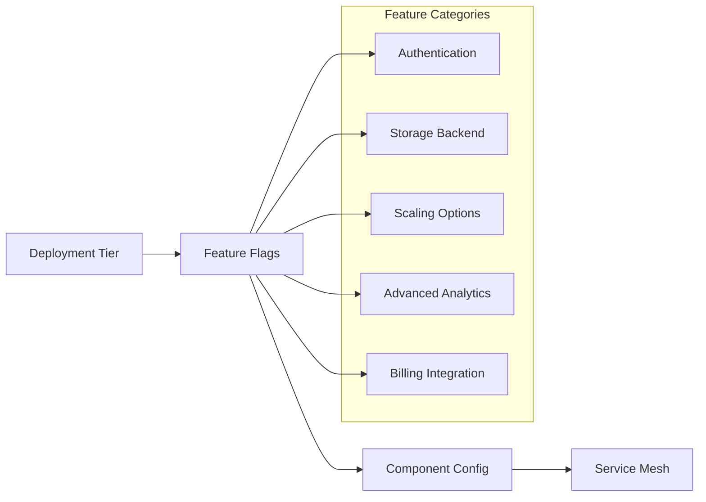
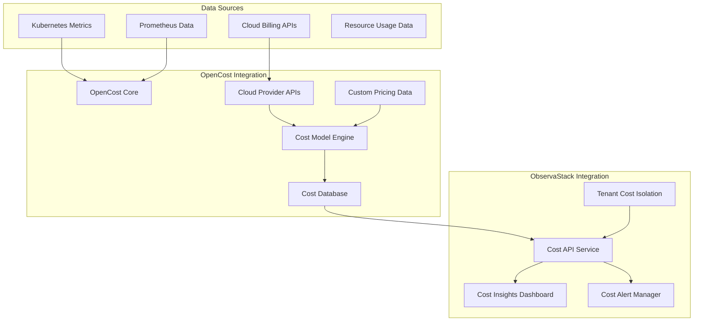
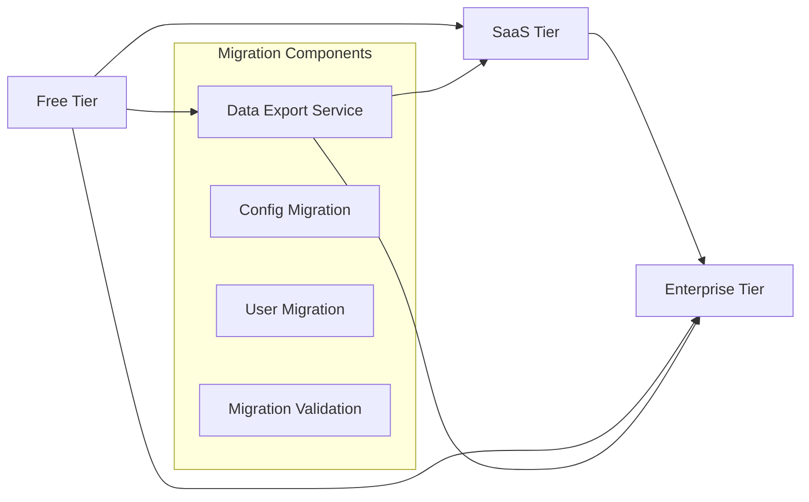

# Design Document

## Overview

The deployment tiers design implements a flexible, modular architecture that supports three distinct ObservaStack offerings: Free Local, SaaS Hosted, and Enterprise On-Premises. The design emphasizes code reuse, configuration-driven deployment, and seamless upgrade paths while maintaining consistent core functionality across all tiers.

The architecture uses a feature flag and configuration-based approach to enable/disable components and capabilities based on the deployment tier, ensuring a single codebase can serve all three business models effectively.

## Architecture

### Tier-Based Architecture Overview

```mermaid
graph TB
    subgraph "Shared Core Components"
        UI[React/TypeScript UI]
        BFF[FastAPI BFF]
        Grafana[Grafana]
        Prometheus[Prometheus]
        Loki[Loki]
        Tempo[Tempo]
    end
    
    subgraph "Free Tier (Local)"
        FreeConfig[Minimal Config]
        LocalAuth[Local Auth Only]
        SingleRedPanda[Single RedPanda]
        NoOpenSearch[No OpenSearch]
        DockerCompose[Docker Compose]
    end
    
    subgraph "SaaS Tier (Hosted)"
        SaaSConfig[Multi-tenant Config]
        Keycloak[Keycloak + SSO]
        RedPandaCluster[RedPanda Cluster]
        OpenSearchCluster[OpenSearch Cluster]
        K8s[Kubernetes]
        OpenCostSaaS[OpenCost]
        Billing[Billing System]
    end
    
    subgraph "Enterprise Tier (On-Prem)"
        EnterpriseConfig[Full Config]
        FullKeycloak[Keycloak + RBAC]
        FullRedPanda[Full RedPanda Cluster]
        FullOpenSearch[Full OpenSearch Cluster]
        OpenCostEnterprise[OpenCost + Custom Pricing]
        AnsibleOrDocker[Ansible/Docker Deploy]
        CustomBranding[Custom Branding]
    end
    
    UI --> BFF
    BFF --> FreeConfig
    BFF --> SaaSConfig
    BFF --> EnterpriseConfig
```



### Configuration-Driven Component Selection

The system uses a hierarchical configuration approach where deployment tier determines which components are enabled:



## Components and Interfaces

### Tier Configuration System

#### Configuration Manager
- **Purpose**: Central configuration management for tier-specific deployments
- **Responsibilities**:
  - Load tier-specific configuration files
  - Validate configuration compatibility
  - Provide runtime feature flag resolution
  - Handle configuration inheritance and overrides

#### Feature Flag Service
```typescript
interface TierConfig {
  tier: 'free' | 'saas' | 'enterprise'
  features: {
    multiTenant: boolean
    advancedAnalytics: boolean
    customBranding: boolean
    ssoIntegration: boolean
    billingIntegration: boolean
    enterpriseSupport: boolean
  }
  components: {
    keycloak: boolean
    openSearch: boolean
    redPandaCluster: boolean
    kong: boolean
    thanos: boolean
    openCost: boolean
  }
  limits: {
    maxUsers: number
    dataRetentionDays: number
    maxTenantsPerInstance: number
    apiRateLimit: number
  }
}
```

### Authentication Architecture by Tier

#### Free Tier Authentication
- **Local User Management**: Simple file-based or SQLite user store
- **No External Dependencies**: Self-contained authentication
- **Basic RBAC**: Simple admin/user roles
- **Session Management**: JWT tokens with local validation

#### SaaS Tier Authentication
- **Keycloak Integration**: Full identity management
- **SSO Providers**: Google, Microsoft, GitHub integration
- **Multi-tenant Isolation**: Tenant-scoped authentication
- **Advanced RBAC**: Role hierarchy with permissions

#### Enterprise Tier Authentication
- **Full Keycloak Deployment**: On-premises identity management
- **LDAP/AD Integration**: Enterprise directory integration
- **Custom SSO**: Customer-specific SSO configurations
- **Audit Logging**: Comprehensive authentication audit trails

### OpenCost Integration Architecture

#### OpenCost Component Overview


#### Tier-Specific OpenCost Configuration

##### SaaS Tier OpenCost
- **Managed Deployment**: Fully managed OpenCost instance
- **Cloud Integration**: Automatic cloud provider billing API integration
- **Multi-tenant Isolation**: Namespace-based cost allocation
- **Real-time Updates**: Hourly cost data updates
- **Automated Alerts**: Cost anomaly detection and alerting

##### Enterprise Tier OpenCost
- **On-premises Deployment**: Customer-controlled OpenCost installation
- **Custom Pricing Models**: Support for custom pricing data and contracts
- **Air-gap Support**: Offline cost calculation capabilities
- **Advanced Chargeback**: Detailed cost allocation and reporting
- **Integration Flexibility**: Custom integrations with enterprise billing systems

### Storage Architecture by Tier

#### Free Tier Storage
```yaml
# Minimal storage configuration
storage:
  logs: loki-single-node
  metrics: prometheus-local
  traces: tempo-local
  search: none  # No OpenSearch
  messaging: redpanda-single
  object: local-filesystem
  costMonitoring: none  # No OpenCost in free tier
```

#### SaaS Tier Storage
```yaml
# Scalable cloud storage
storage:
  logs: loki-cluster
  metrics: prometheus-ha + thanos
  traces: tempo-cluster
  search: opensearch-cluster
  messaging: redpanda-cluster
  object: s3-compatible
  costMonitoring: opencost-saas  # Managed OpenCost with cloud provider integration
```

#### Enterprise Tier Storage
```yaml
# Full enterprise storage
storage:
  logs: loki-cluster-ha
  metrics: prometheus-ha + thanos-ha
  traces: tempo-cluster-ha
  search: opensearch-cluster-ha
  messaging: redpanda-cluster-ha
  object: minio-cluster
  costMonitoring: opencost-enterprise  # Full OpenCost with custom pricing and air-gap support
```

### Deployment Architecture

#### Free Tier Deployment
- **Docker Compose**: Single-file deployment
- **Resource Requirements**: 8GB RAM, 4 CPU cores
- **Installation Time**: < 5 minutes
- **Components**: Core observability stack only
- **Networking**: Simple bridge networking

#### SaaS Tier Deployment
- **Kubernetes**: Managed container orchestration
- **Auto-scaling**: Horizontal pod autoscaling
- **Multi-tenancy**: Namespace isolation
- **Load Balancing**: Ingress controllers
- **Monitoring**: Platform-level observability

#### Enterprise Tier Deployment
- **Ansible Playbooks**: Infrastructure as code
- **Docker Compose Option**: Simplified enterprise deployment
- **VM/Physical Servers**: Bare metal deployment support
- **High Availability**: Multi-node clustering
- **Custom Networking**: VLAN and security group support

## Data Models

### Tier Configuration Models

```typescript
interface DeploymentTier {
  id: string
  name: 'free' | 'saas' | 'enterprise'
  displayName: string
  description: string
  features: TierFeatures
  limits: TierLimits
  pricing: TierPricing
}

interface TierFeatures {
  authentication: AuthenticationFeatures
  storage: StorageFeatures
  analytics: AnalyticsFeatures
  deployment: DeploymentFeatures
  support: SupportFeatures
}

interface AuthenticationFeatures {
  localUsers: boolean
  keycloak: boolean
  ssoProviders: string[]
  multiTenant: boolean
  rbac: 'basic' | 'advanced' | 'enterprise'
}

interface StorageFeatures {
  openSearch: boolean
  redPandaCluster: boolean
  thanosLongTerm: boolean
  highAvailability: boolean
  dataRetentionDays: number
}
```

### Billing and Usage Models (SaaS Tier)

```typescript
interface SaaSSubscription {
  id: string
  customerId: string
  plan: 'starter' | 'professional' | 'enterprise'
  billingCycle: 'monthly' | 'annual'
  usage: UsageMetrics
  limits: SubscriptionLimits
  status: 'active' | 'suspended' | 'cancelled'
}

interface UsageMetrics {
  dataIngestionGB: number
  activeUsers: number
  apiCalls: number
  storageGB: number
  computeHours: number
}

interface SubscriptionLimits {
  maxDataIngestionGB: number
  maxActiveUsers: number
  maxApiCallsPerMonth: number
  maxStorageGB: number
  dataRetentionDays: number
}
```

### Enterprise Configuration Models

```typescript
interface EnterpriseConfig {
  customization: {
    branding: BrandingConfig
    whiteLabel: boolean
    customDomains: string[]
  }
  integration: {
    ldapConfig?: LDAPConfig
    ssoConfig?: SSOConfig
    webhooks: WebhookConfig[]
    openCostConfig: OpenCostConfig
  }
  deployment: {
    method: 'ansible' | 'docker-compose' | 'kubernetes'
    highAvailability: boolean
    backupStrategy: BackupConfig
  }
}

interface OpenCostConfig {
  enabled: boolean
  deployment: 'managed' | 'self-hosted'
  cloudProviders: CloudProviderConfig[]
  customPricing?: CustomPricingConfig
  tenantIsolation: boolean
  alerting: CostAlertConfig
  reporting: CostReportConfig
}

interface CloudProviderConfig {
  provider: 'aws' | 'gcp' | 'azure' | 'custom'
  credentials: ProviderCredentials
  billingAccount: string
  regions: string[]
}

interface CustomPricingConfig {
  cpuHourlyRate: number
  memoryGBHourlyRate: number
  storageGBMonthlyRate: number
  networkGBRate: number
  customRates: Record<string, number>
}

interface CostAlertConfig {
  budgetAlerts: BudgetAlert[]
  anomalyDetection: boolean
  thresholds: CostThreshold[]
}

interface CostReportConfig {
  chargebackEnabled: boolean
  showbackEnabled: boolean
  reportingPeriods: ('daily' | 'weekly' | 'monthly')[]
  exportFormats: ('csv' | 'json' | 'pdf')[]
}
```

## Error Handling

### Tier-Specific Error Handling

#### Free Tier Error Handling
- **Simplified Error Messages**: User-friendly error reporting
- **Local Logging**: File-based error logging
- **Self-Service Recovery**: Built-in recovery procedures
- **Community Support**: Documentation and forums

#### SaaS Tier Error Handling
- **Centralized Error Tracking**: Sentry or similar service
- **Customer Notifications**: Proactive issue communication
- **SLA Monitoring**: Service level agreement tracking
- **Automated Recovery**: Self-healing infrastructure

#### Enterprise Tier Error Handling
- **Enterprise Logging**: Integration with customer SIEM
- **Priority Support**: Dedicated support channels
- **Custom Alerting**: Customer-specific alert routing
- **Professional Services**: On-site support options

### Configuration Validation

```python
class TierConfigValidator:
    def validate_free_tier(self, config: TierConfig) -> ValidationResult:
        """Validate free tier configuration constraints."""
        errors = []
        
        if config.features.multiTenant:
            errors.append("Multi-tenancy not available in free tier")
        
        if config.components.keycloak:
            errors.append("Keycloak not available in free tier")
        
        if config.components.openCost:
            errors.append("OpenCost not available in free tier")
        
        if config.limits.maxUsers > 10:
            errors.append("Free tier limited to 10 users")
        
        return ValidationResult(valid=len(errors) == 0, errors=errors)
    
    def validate_saas_tier(self, config: TierConfig) -> ValidationResult:
        """Validate SaaS tier configuration."""
        errors = []
        
        if config.components.openCost and not config.features.multiTenant:
            errors.append("OpenCost requires multi-tenancy in SaaS tier")
        
        if config.components.openCost and not config.components.keycloak:
            errors.append("OpenCost requires Keycloak authentication in SaaS tier")
        
        return ValidationResult(valid=len(errors) == 0, errors=errors)
    
    def validate_enterprise_tier(self, config: TierConfig) -> ValidationResult:
        """Validate enterprise tier configuration."""
        errors = []
        
        # Enterprise tier has access to all features, minimal validation needed
        if config.components.openCost:
            # Validate OpenCost configuration is complete
            if not hasattr(config, 'openCostConfig'):
                errors.append("OpenCost configuration required for enterprise tier")
        
        return ValidationResult(valid=len(errors) == 0, errors=errors)
```

## Testing Strategy

### Tier-Specific Testing

#### Free Tier Testing
- **Resource Constraint Testing**: Verify operation under limited resources
- **Installation Testing**: Automated installation validation
- **Upgrade Path Testing**: Test migration to paid tiers
- **Offline Testing**: Verify operation without internet connectivity

#### SaaS Tier Testing
- **Multi-tenant Testing**: Tenant isolation and security
- **Scaling Testing**: Auto-scaling behavior validation
- **Billing Integration Testing**: Usage tracking and billing accuracy
- **SLA Testing**: Performance and availability validation

#### Enterprise Tier Testing
- **Deployment Testing**: Ansible playbook validation including OpenCost deployment
- **High Availability Testing**: Failover and recovery testing
- **Integration Testing**: LDAP, SSO, webhook integrations, and OpenCost cloud provider integrations
- **Security Testing**: Penetration testing and vulnerability assessment
- **Cost Accuracy Testing**: Validation of cost calculations and billing accuracy

### Cross-Tier Testing

```python
class TierCompatibilityTests:
    def test_core_functionality_consistency(self):
        """Ensure core features work identically across tiers."""
        for tier in ['free', 'saas', 'enterprise']:
            config = load_tier_config(tier)
            app = create_app(config)
            
            # Test core search functionality
            assert app.search_service.search("test") is not None
            
            # Test dashboard rendering
            assert app.dashboard_service.get_dashboard("main") is not None
    
    def test_opencost_integration(self):
        """Test OpenCost integration in SaaS and Enterprise tiers."""
        for tier in ['saas', 'enterprise']:
            config = load_tier_config(tier)
            if config.components.openCost:
                app = create_app(config)
                
                # Test cost data retrieval
                cost_service = app.cost_service
                assert cost_service.get_cost_data("test-namespace") is not None
                
                # Test tenant isolation for cost data
                tenant_costs = cost_service.get_tenant_costs("tenant-1")
                assert tenant_costs is not None
                
                # Test cost alerting
                alerts = cost_service.get_cost_alerts("tenant-1")
                assert isinstance(alerts, list)
    
    def test_upgrade_path_compatibility(self):
        """Test data migration between tiers."""
        # Test free -> saas migration
        # Test saas -> enterprise migration
        # Test OpenCost data migration for tier upgrades
        pass
```

## Performance Considerations

### Tier-Specific Performance Optimization

#### Free Tier Performance
- **Minimal Resource Usage**: Optimized for single-node deployment
- **Efficient Caching**: Local caching to reduce resource usage
- **Component Pruning**: Disable unnecessary services
- **Graceful Degradation**: Handle resource constraints elegantly

#### SaaS Tier Performance
- **Horizontal Scaling**: Auto-scaling based on demand
- **Multi-tenant Optimization**: Efficient resource sharing
- **CDN Integration**: Global content delivery
- **Performance Monitoring**: Real-time performance tracking

#### Enterprise Tier Performance
- **Custom Optimization**: Customer-specific performance tuning
- **High Availability**: Zero-downtime deployments
- **Performance Analytics**: Detailed performance insights
- **Capacity Planning**: Proactive scaling recommendations

### Resource Allocation Strategy

```yaml
# Free Tier Resource Limits
free_tier:
  cpu_limit: "2000m"
  memory_limit: "4Gi"
  storage_limit: "50Gi"
  retention_days: 7

# SaaS Tier Resource Scaling
saas_tier:
  cpu_request: "500m"
  cpu_limit: "4000m"
  memory_request: "2Gi"
  memory_limit: "16Gi"
  auto_scaling: true
  retention_days: 30

# Enterprise Tier Resource Configuration
enterprise_tier:
  cpu_request: "2000m"
  cpu_limit: "unlimited"
  memory_request: "8Gi"
  memory_limit: "unlimited"
  custom_scaling: true
  retention_days: 365
```

## Security Considerations

### Tier-Specific Security Models

#### Free Tier Security
- **Basic Authentication**: Local user management
- **Network Isolation**: Docker network security
- **Data Encryption**: Encryption at rest for local storage
- **Security Updates**: Automated security patching

#### SaaS Tier Security
- **Multi-tenant Security**: Strict tenant isolation
- **SOC 2 Compliance**: Industry-standard security controls
- **Data Encryption**: End-to-end encryption
- **Security Monitoring**: 24/7 security operations center

#### Enterprise Tier Security
- **Custom Security Policies**: Customer-defined security rules
- **Compliance Support**: HIPAA, SOX, PCI DSS compliance
- **Air-gapped Deployment**: Offline deployment options
- **Security Auditing**: Comprehensive audit logging

### Security Implementation

```python
class TierSecurityManager:
    def __init__(self, tier: str):
        self.tier = tier
        self.security_config = load_security_config(tier)
    
    def authenticate_user(self, credentials: dict) -> User:
        if self.tier == 'free':
            return self.local_auth.authenticate(credentials)
        elif self.tier in ['saas', 'enterprise']:
            return self.keycloak_auth.authenticate(credentials)
    
    def authorize_action(self, user: User, action: str, resource: str) -> bool:
        if self.tier == 'free':
            return self.basic_rbac.check_permission(user, action, resource)
        else:
            return self.advanced_rbac.check_permission(user, action, resource)
```

## Migration and Upgrade Paths

### Tier Migration Architecture



### Migration Services

```python
class TierMigrationService:
    def migrate_free_to_saas(self, free_instance: FreeInstance) -> SaaSInstance:
        """Migrate from free tier to SaaS tier."""
        # Export data from free instance
        data = self.export_free_data(free_instance)
        
        # Create SaaS tenant
        saas_tenant = self.create_saas_tenant(data.organization)
        
        # Import data to SaaS instance
        self.import_to_saas(saas_tenant, data)
        
        # Validate migration
        self.validate_migration(free_instance, saas_tenant)
        
        return saas_tenant
    
    def migrate_saas_to_enterprise(self, saas_tenant: SaasTenant) -> EnterpriseInstance:
        """Migrate from SaaS tier to enterprise tier."""
        # Similar migration logic for SaaS to Enterprise
        pass
```

This design provides a comprehensive foundation for implementing the three-tier business model while maintaining code consistency and enabling smooth customer upgrade paths.