# Design Document

## Overview

The observability test stack is designed as a complete, isolated testing environment that mirrors the production ObservaStack platform while adding comprehensive testing capabilities. The architecture includes the full application stack (React frontend, FastAPI backend, and all infrastructure components) plus additional testing services for synthetic data generation, load testing, chaos engineering, and automated validation.

The test stack provides a safe environment for destructive testing, performance validation, and end-to-end verification without impacting production systems. It serves as a quality gate for deployments and ensures the platform can handle real-world scenarios.

## Architecture

### High-Level Test Stack Architecture

```mermaid
graph TB
    subgraph "Test Application Stack"
        subgraph "Frontend Layer"
            UI[React/TypeScript UI]
            Router[React Router]
            Views[Search/Alerts/Insights/Admin Views]
        end
        
        subgraph "Backend Layer"
            BFF[FastAPI BFF]
            Auth[Authentication Service]
            Search[Search Service]
            Alerts[Alert Management]
            Insights[Insights Engine]
        end
        
        subgraph "Identity & Security"
            KC[Keycloak]
            Kong[Kong API Gateway]
        end
        
        subgraph "Observability Infrastructure"
            Prom[Prometheus A/B]
            Thanos[Thanos Query]
            Loki[Loki]
            Tempo[Tempo]
            OS[OpenSearch Cluster]
            Grafana[Grafana]
        end
        
        subgraph "Storage & Messaging"
            MinIO[MinIO S3]
            RedPanda[RedPanda Cluster]
            Vector[Vector Aggregator]
            Redis[Redis Cache]
        end
    end
    
    subgraph "Testing Infrastructure"
        subgraph "Test Orchestration"
            TestRunner[Test Runner]
            TestDB[Test Results DB]
            TestDashboard[Test Dashboard]
        end
        
        subgraph "Data Generation"
            SyntheticData[Synthetic Data Generator]
            LogGen[Log Generator]
            MetricGen[Metric Generator]
            TraceGen[Trace Generator]
        end
        
        subgraph "Load Testing"
            LoadTest[Load Test Engine]
            UserSim[User Simulator]
            APILoad[API Load Tester]
        end
        
        subgraph "Chaos Engineering"
            ChaosEngine[Chaos Engine]
            FailureInjector[Failure Injector]
            NetworkChaos[Network Chaos]
        end
        
        subgraph "Validation & Monitoring"
            E2ETests[E2E Test Suite]
            ContractTests[Contract Tests]
            SecurityTests[Security Scanner]
            HealthMonitor[Health Monitor]
        end
    end
    
    UI --> BFF
    BFF --> KC
    BFF --> Prom
    BFF --> Loki
    BFF --> Tempo
    BFF --> OS
    BFF --> Grafana
    BFF --> Redis
    Kong --> BFF
    
    TestRunner --> E2ETests
    TestRunner --> ContractTests
    TestRunner --> SecurityTests
    TestRunner --> LoadTest
    TestRunner --> ChaosEngine
    
    SyntheticData --> LogGen
    SyntheticData --> MetricGen
    SyntheticData --> TraceGen
    
    LogGen --> Loki
    MetricGen --> Prom
    TraceGen --> Tempo
    
    LoadTest --> UI
    LoadTest --> BFF
    UserSim --> UI
    APILoad --> BFF
    
    ChaosEngine --> FailureInjector
    ChaosEngine --> NetworkChaos
    
    HealthMonitor --> TestDB
    TestRunner --> TestDB
    TestDashboard --> TestDB
```



### Component Architecture

The test stack extends the production architecture with additional testing layers:

1. **Application Stack**: Complete ObservaStack deployment identical to production
2. **Test Orchestration**: Centralized test execution and result management
3. **Data Generation**: Synthetic data creation for realistic testing scenarios
4. **Load Testing**: Performance and scalability validation
5. **Chaos Engineering**: Resilience and failure recovery testing
6. **Validation & Monitoring**: Comprehensive test execution and health monitoring

## Components and Interfaces

### Application Stack Components

The test stack includes all production components with test-specific configurations:

#### Frontend Application
- **React/TypeScript UI**: Complete frontend application with all views
- **Test Configuration**: Environment variables for test endpoints and authentication
- **Debug Mode**: Enhanced logging and debugging capabilities for test analysis

#### Backend Application
- **FastAPI BFF**: Complete backend with all production endpoints
- **Test Data APIs**: Additional endpoints for test data management and validation
- **Mock Services**: Configurable mock responses for isolated testing

#### Infrastructure Components
- **Keycloak**: Identity provider with pre-configured test users and tenants
- **Redis**: Caching layer for session management, token storage, and application caching
- **Grafana**: Dashboard platform with test-specific dashboards and data sources
- **Prometheus/Thanos**: Metrics collection with test data retention policies
- **Loki**: Log aggregation with test log streams and labels
- **Tempo**: Distributed tracing with synthetic trace generation
- **OpenSearch**: Search engine with test indexes and data

### Testing Infrastructure Components

#### Test Orchestration

##### Test Runner
- **Purpose**: Centralized test execution and coordination
- **Features**:
  - Test suite scheduling and execution
  - Parallel test execution management
  - Test result aggregation and reporting
  - Integration with CI/CD pipelines

##### Test Results Database
- **Purpose**: Persistent storage of test execution data
- **Schema**:
  - Test execution metadata
  - Performance metrics and benchmarks
  - Failure analysis and debugging information
  - Historical trend data

##### Test Dashboard
- **Purpose**: Visualization of test results and system health
- **Features**:
  - Real-time test execution monitoring
  - Historical performance trends
  - Failure analysis and debugging tools
  - Test coverage and quality metrics

#### Data Generation Services

##### Synthetic Data Generator
- **Purpose**: Orchestrates realistic test data creation
- **Features**:
  - Configurable data patterns and volumes
  - Multi-tenant data generation with proper isolation
  - Realistic error and anomaly injection
  - Time-series data with configurable patterns

##### Log Generator
- **Purpose**: Creates realistic log data for testing
- **Implementation**:
  - Application logs with various severity levels
  - Infrastructure logs from different components
  - Error logs with realistic stack traces
  - Structured and unstructured log formats

##### Metric Generator
- **Purpose**: Generates realistic metrics data
- **Implementation**:
  - System metrics (CPU, memory, disk, network)
  - Application metrics (response times, error rates)
  - Business metrics (user activity, feature usage)
  - Custom metrics with configurable cardinality

##### Trace Generator
- **Purpose**: Creates distributed traces for testing
- **Implementation**:
  - Multi-service trace spans
  - Realistic service dependencies
  - Error and latency injection
  - Cross-signal correlation with logs and metrics

#### Load Testing Services

##### Load Test Engine
- **Purpose**: Coordinates performance and scalability testing
- **Features**:
  - Configurable load patterns (ramp-up, steady-state, spike)
  - Multi-protocol support (HTTP, WebSocket, gRPC)
  - Distributed load generation
  - Real-time performance monitoring

##### User Simulator
- **Purpose**: Simulates realistic user behavior patterns
- **Features**:
  - Multi-tenant user simulation
  - Realistic user journeys and workflows
  - Authentication and session management
  - Browser-based interaction simulation

##### API Load Tester
- **Purpose**: Validates API performance under load
- **Features**:
  - REST API endpoint testing
  - Authentication token management
  - Request/response validation
  - Rate limiting and throttling tests

#### Chaos Engineering Services

##### Chaos Engine
- **Purpose**: Orchestrates failure injection and resilience testing
- **Features**:
  - Configurable failure scenarios
  - Gradual failure injection
  - Recovery validation
  - Blast radius control

##### Failure Injector
- **Purpose**: Injects various types of failures
- **Capabilities**:
  - Service outages and restarts
  - Resource exhaustion (CPU, memory, disk)
  - Database connection failures
  - External service timeouts

##### Network Chaos
- **Purpose**: Simulates network-related failures
- **Capabilities**:
  - Network partitions and splits
  - Latency and packet loss injection
  - Bandwidth throttling
  - DNS resolution failures

#### Validation & Monitoring Services

##### E2E Test Suite
- **Purpose**: Comprehensive end-to-end application testing
- **Coverage**:
  - User authentication and authorization
  - Search functionality across all data types
  - Alert management workflows
  - Cross-signal correlation and navigation
  - Multi-tenant isolation validation

##### Contract Tests
- **Purpose**: API contract validation and compatibility testing
- **Features**:
  - OpenAPI specification validation
  - Request/response schema verification
  - Authentication and authorization testing
  - Backward compatibility validation

##### Security Scanner
- **Purpose**: Automated security testing and vulnerability assessment
- **Features**:
  - Container image vulnerability scanning
  - Dependency security analysis
  - Authentication bypass testing
  - Tenant isolation validation
  - OWASP security testing

##### Health Monitor
- **Purpose**: Continuous monitoring of test environment health
- **Features**:
  - Service availability monitoring
  - Performance baseline tracking
  - Resource utilization monitoring
  - Test environment drift detection

## Data Models

### Test Execution Models
```typescript
interface TestExecution {
  id: string
  testSuite: string
  startTime: Date
  endTime?: Date
  status: 'running' | 'passed' | 'failed' | 'cancelled'
  results: TestResult[]
  environment: TestEnvironment
  configuration: TestConfiguration
}

interface TestResult {
  testName: string
  status: 'passed' | 'failed' | 'skipped'
  duration: number
  errorMessage?: string
  metrics: TestMetrics
  artifacts: TestArtifact[]
}
```

### Synthetic Data Models
```typescript
interface SyntheticDataConfig {
  tenantId: string
  dataType: 'logs' | 'metrics' | 'traces'
  volume: DataVolume
  pattern: DataPattern
  timeRange: TimeRange
  errorRate: number
}

interface DataPattern {
  type: 'steady' | 'spike' | 'seasonal' | 'random'
  parameters: Record<string, any>
}
```

### Load Test Models
```typescript
interface LoadTestConfig {
  name: string
  target: LoadTestTarget
  loadPattern: LoadPattern
  duration: number
  maxUsers: number
  rampUpTime: number
  thresholds: PerformanceThresholds
}

interface PerformanceThresholds {
  responseTime: number
  errorRate: number
  throughput: number
}
```

### Chaos Experiment Models
```typescript
interface ChaosExperiment {
  id: string
  name: string
  hypothesis: string
  method: ChaosMethod
  rollback: RollbackStrategy
  steadyStateHypothesis: SteadyStateCheck
  probes: ChaosProbe[]
}

interface ChaosMethod {
  type: 'service-failure' | 'network-chaos' | 'resource-exhaustion'
  parameters: Record<string, any>
  duration: number
}
```

## Testing Strategy

### Test Environment Isolation
- **Network Isolation**: Separate network segments for test and production
- **Data Isolation**: Dedicated storage and databases for test data
- **Resource Isolation**: Separate compute resources to prevent interference
- **Configuration Isolation**: Test-specific configuration and secrets

### Test Data Management
- **Synthetic Data**: Realistic but artificial data for testing
- **Data Refresh**: Automated test data reset and regeneration
- **Data Retention**: Configurable retention policies for test data
- **Data Privacy**: No production data in test environments

### Test Execution Strategies
- **Parallel Execution**: Multiple test suites running concurrently
- **Test Prioritization**: Critical path tests executed first
- **Incremental Testing**: Only test changed components when possible
- **Smoke Testing**: Quick validation of basic functionality

### Performance Testing
- **Baseline Establishment**: Performance benchmarks for comparison
- **Regression Testing**: Detect performance degradation
- **Scalability Testing**: Validate system behavior under increasing load
- **Stress Testing**: Identify breaking points and failure modes

## Deployment Architecture

### Test Environment Deployment
- **Docker Compose**: Complete stack deployment for local testing
- **Kubernetes**: Scalable test environment for comprehensive testing
- **Infrastructure as Code**: Terraform/Ansible for reproducible deployments
- **Environment Provisioning**: Automated test environment creation and teardown

### Test Data Deployment
- **Data Seeding**: Automated test data population
- **Schema Migration**: Database schema updates for test environments
- **Configuration Management**: Environment-specific test configurations
- **Secrets Management**: Secure handling of test credentials and tokens

### CI/CD Integration
- **Pipeline Integration**: Automated test execution in deployment pipelines
- **Quality Gates**: Test results determine deployment progression
- **Artifact Management**: Test results and reports storage
- **Notification**: Test failure alerts and reporting

## Monitoring and Observability

### Test Execution Monitoring
- **Real-time Dashboards**: Live test execution status and metrics
- **Performance Tracking**: Test execution time and resource usage
- **Failure Analysis**: Detailed failure investigation and root cause analysis
- **Trend Analysis**: Historical test performance and reliability trends

### Test Environment Health
- **Infrastructure Monitoring**: Test environment resource utilization
- **Service Health**: Application and infrastructure service status
- **Data Quality**: Test data integrity and consistency validation
- **Environment Drift**: Detection of configuration changes and drift

### Alerting and Notifications
- **Test Failure Alerts**: Immediate notification of test failures
- **Performance Degradation**: Alerts for performance regression
- **Environment Issues**: Infrastructure and service health alerts
- **Capacity Planning**: Resource utilization and scaling alerts

## Security Considerations

### Test Environment Security
- **Access Control**: Restricted access to test environments
- **Network Security**: Firewall rules and network segmentation
- **Data Protection**: Encryption of test data and communications
- **Audit Logging**: Comprehensive audit trail for test activities

### Test Data Security
- **Synthetic Data**: No production data in test environments
- **Data Masking**: Anonymization of any production-like data
- **Secure Storage**: Encrypted storage of test data and credentials
- **Data Lifecycle**: Automated cleanup of sensitive test data

### Vulnerability Testing
- **Security Scanning**: Automated vulnerability assessment
- **Penetration Testing**: Simulated attacks and security validation
- **Compliance Testing**: Validation of security and compliance requirements
- **Threat Modeling**: Security risk assessment and mitigation