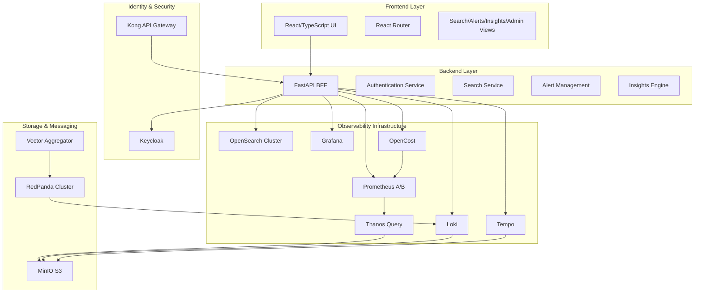

# Design Document

## Overview

The unified observability stack is designed as a multi-tenant, web-based platform that consolidates logs, metrics, traces, and alerts into a single interface. The architecture follows a Backend-for-Frontend (BFF) pattern with a React/TypeScript frontend and FastAPI backend, providing a unified experience over multiple open-source observability tools.

The system leverages existing infrastructure components (Prometheus, Grafana, Loki, Tempo, OpenSearch, OpenCost) while adding a custom application layer that provides unified navigation, multi-tenant security, and cross-signal correlation capabilities.

## Architecture

### High-Level Architecture



### Component Architecture

The system is organized into distinct layers:

1. **Presentation Layer**: React-based SPA with embedded Grafana panels
2. **API Layer**: FastAPI BFF providing unified APIs
3. **Security Layer**: Keycloak + Kong for authentication and authorization
4. **Data Layer**: Multiple specialized data stores for different signal types
5. **Infrastructure Layer**: Container orchestration and service mesh

## Components and Interfaces

### Frontend Components

#### Shell Application (`App.tsx`)
- **Purpose**: Main application shell providing navigation and layout
- **Responsibilities**:
  - Route management and navigation
  - Consistent UI layout and branding
  - Authentication state management
  - Tenant context propagation

#### View Components
- **Search View**: Unified search interface across logs, metrics, and traces
- **Alerts View**: Centralized alert management and triage
- **Insights View**: Cost optimization and performance insights dashboard
- **Admin View**: System configuration and tenant management

#### Embedded Grafana Integration
- **Purpose**: Seamless integration of Grafana dashboards within the custom UI
- **Implementation**: iframe embedding with authentication token passing
- **Features**: Consistent theming, navigation preservation, cross-panel linking

### Backend Components

#### FastAPI BFF (`main.py`)
- **Purpose**: Backend-for-Frontend providing unified API layer
- **Endpoints**:
  - `/api/auth/*` - Authentication and authorization
  - `/api/search/*` - Unified search across data sources
  - `/api/alerts/*` - Alert management and webhook ingestion
  - `/api/insights/*` - Performance and cost insights
  - `/api/costs/*` - OpenCost integration and cost monitoring
  - `/api/meta/*` - System metadata and feature flags

#### Authentication Service
- **Integration**: Keycloak for identity management
- **Features**:
  - JWT token validation
  - Multi-tenant user isolation
  - Role-based access control
  - Session management

#### Search Service
- **Purpose**: Unified search across multiple data sources
- **Data Sources**:
  - Logs: Loki + OpenSearch
  - Metrics: Prometheus/Thanos
  - Traces: Tempo
- **Features**:
  - Cross-signal correlation
  - Streaming search results
  - Advanced filtering and aggregation

#### Alert Management Service
- **Purpose**: Centralized alert processing and management
- **Features**:
  - Webhook ingestion from Alertmanager
  - Alert deduplication and grouping
  - Assignment and acknowledgment workflows
  - Integration with notification channels

#### Insights Engine
- **Purpose**: Performance analysis and cost optimization powered by OpenCost
- **Features**:
  - Resource utilization analysis
  - Cost trend analysis using OpenCost data
  - Rightsizing recommendations based on OpenCost metrics
  - Anomaly detection for cost and performance
  - Kubernetes cost allocation and chargeback
  - Multi-cloud cost monitoring integration

#### Cost Monitoring Service
- **Purpose**: OpenCost integration and Kubernetes cost management
- **Features**:
  - Real-time cost data collection from OpenCost
  - Multi-tenant cost isolation and allocation
  - Cost alert generation and threshold monitoring
  - Chargeback and showback report generation
  - Cloud provider billing API integration
  - Custom pricing model support for on-premises deployments

### Infrastructure Components

#### Identity and Access Management
- **Keycloak**: Multi-tenant identity provider
- **Kong**: API gateway for routing and authentication
- **Features**: RBAC, tenant isolation, SSO integration

#### Data Storage
- **Prometheus A/B**: High-availability metrics collection
- **Thanos**: Long-term metrics storage and querying
- **Loki**: Log aggregation and storage
- **Tempo**: Distributed tracing storage
- **OpenSearch**: Full-text search and log analytics
- **MinIO**: S3-compatible object storage

#### Message Processing
- **RedPanda**: Kafka-compatible message streaming
- **Vector**: Log and metrics aggregation
- **OpenTelemetry Collector**: Trace and metrics collection

#### Cost Monitoring
- **OpenCost**: Kubernetes cost monitoring and allocation
- **Cloud Provider APIs**: Cost data integration for AWS, GCP, Azure
- **Custom Pricing**: Support for on-premises and custom pricing models

## Data Models

### User and Tenant Models
```typescript
interface User {
  id: string
  username: string
  email: string
  tenantId: string
  roles: Role[]
  preferences: UserPreferences
}

interface Tenant {
  id: string
  name: string
  domain: string
  settings: TenantSettings
  dataRetention: RetentionPolicy
}
```

### Search Models
```typescript
interface SearchQuery {
  freeText: string
  type: 'logs' | 'metrics' | 'traces' | 'all'
  timeRange: TimeRange
  filters: SearchFilter[]
  tenantId: string
}

interface SearchResult {
  items: SearchItem[]
  stats: SearchStats
  facets: SearchFacet[]
}
```

### Alert Models
```typescript
interface Alert {
  id: string
  severity: 'critical' | 'high' | 'medium' | 'low'
  title: string
  description: string
  source: string
  timestamp: Date
  status: 'active' | 'acknowledged' | 'resolved'
  assignee?: string
  tenantId: string
  labels: Record<string, string>
}
```

### Insights Models
```typescript
interface InsightMetric {
  name: string
  value: number
  trend: 'up' | 'down' | 'stable'
  recommendation?: string
  severity: 'info' | 'warning' | 'critical'
}

interface CostInsight {
  category: string
  currentCost: number
  projectedCost: number
  savingsOpportunity: number
  recommendations: Recommendation[]
}
```

### OpenCost Models
```typescript
interface KubernetesCost {
  namespace: string
  workload: string
  service?: string
  cpuCost: number
  memoryCost: number
  storageCost: number
  networkCost: number
  totalCost: number
  efficiency: number
  recommendations: CostOptimization[]
  tenantId: string
}

interface CostAllocation {
  resourceType: 'cpu' | 'memory' | 'storage' | 'network'
  allocatedCost: number
  actualUsage: number
  efficiency: number
  wastedCost: number
  optimizationPotential: number
}

interface CostAlert {
  id: string
  type: 'budget_exceeded' | 'anomaly_detected' | 'efficiency_low'
  threshold: number
  currentValue: number
  namespace: string
  workload?: string
  severity: 'low' | 'medium' | 'high' | 'critical'
  recommendations: string[]
  tenantId: string
}

interface CostOptimization {
  type: 'rightsizing' | 'scheduling' | 'storage' | 'networking'
  description: string
  potentialSavings: number
  implementationEffort: 'low' | 'medium' | 'high'
  riskLevel: 'low' | 'medium' | 'high'
  steps: string[]
}
```

## Error Handling

### Frontend Error Handling
- **Global Error Boundary**: Catches and displays React component errors
- **API Error Handling**: Consistent error response processing
- **User Feedback**: Toast notifications and error states
- **Retry Logic**: Automatic retry for transient failures

### Backend Error Handling
- **Structured Logging**: Consistent error logging with correlation IDs
- **HTTP Status Codes**: Proper REST API error responses
- **Circuit Breaker**: Protection against downstream service failures
- **Graceful Degradation**: Fallback responses when services are unavailable

### Infrastructure Error Handling
- **Health Checks**: Comprehensive service health monitoring
- **Alerting**: Proactive notification of system issues
- **Backup and Recovery**: Data protection and disaster recovery
- **Monitoring**: End-to-end observability of the platform itself

## Testing Strategy

### Frontend Testing
- **Unit Tests**: Jest + React Testing Library for component testing
- **Integration Tests**: API integration and user flow testing
- **E2E Tests**: Cypress for full application workflow testing
- **Visual Regression**: Screenshot comparison for UI consistency

### Backend Testing
- **Unit Tests**: pytest for individual function testing
- **Integration Tests**: FastAPI TestClient for API endpoint testing
- **Contract Tests**: OpenAPI specification validation
- **Load Tests**: Performance testing under realistic load

### Infrastructure Testing
- **Container Tests**: Docker image validation and security scanning
- **Deployment Tests**: Ansible playbook validation
- **Chaos Engineering**: Resilience testing with controlled failures
- **Performance Tests**: End-to-end performance benchmarking

### Multi-tenant Testing
- **Isolation Tests**: Verify tenant data separation including cost data
- **Permission Tests**: RBAC enforcement validation for cost access
- **Scale Tests**: Multi-tenant performance under load
- **Security Tests**: Authentication and authorization validation

### OpenCost Integration Testing
- **Cost Data Accuracy**: Validate cost calculations and allocations
- **Tenant Isolation**: Ensure cost data is properly isolated between tenants
- **Cloud Provider Integration**: Test billing API integrations for AWS, GCP, Azure
- **Alert Generation**: Validate cost threshold alerts and anomaly detection
- **Performance Testing**: Test OpenCost data ingestion and query performance
- **Chargeback Accuracy**: Validate cost allocation and reporting accuracy

## Deployment Architecture

### Development Environment
- **Docker Compose**: Full stack local development
- **Hot Reload**: Frontend and backend development servers
- **Mock Data**: Synthetic data for development and testing
- **Debug Tools**: Integrated debugging and profiling

### Production Environment
- **Ansible Deployment**: Infrastructure as code deployment
- **Container Orchestration**: Docker Swarm or Kubernetes
- **Load Balancing**: Kong API gateway with upstream load balancing
- **SSL/TLS**: Automated certificate management
- **Monitoring**: Comprehensive platform monitoring

### Security Considerations
- **Network Segmentation**: Isolated networks for different components
- **Secrets Management**: Encrypted storage of sensitive configuration
- **Regular Updates**: Automated security patching
- **Audit Logging**: Comprehensive audit trail for compliance
- **Data Encryption**: Encryption at rest and in transit

## Performance Considerations

### Frontend Performance
- **Code Splitting**: Lazy loading of route components
- **Caching**: Browser caching of static assets
- **Bundle Optimization**: Tree shaking and minification
- **CDN**: Content delivery network for static assets

### Backend Performance
- **Connection Pooling**: Efficient database connection management
- **Caching**: Redis caching for frequently accessed data
- **Async Processing**: Non-blocking I/O for concurrent requests
- **Query Optimization**: Efficient data source queries

### Data Storage Performance
- **Indexing**: Optimized indexes for search performance
- **Partitioning**: Time-based data partitioning
- **Compression**: Data compression for storage efficiency
- **Retention**: Automated data lifecycle management

### OpenCost Performance
- **Cost Data Caching**: Redis caching for frequently accessed cost metrics
- **Batch Processing**: Efficient batch processing of cost calculations
- **Query Optimization**: Optimized queries for cost data aggregation
- **Data Retention**: Configurable retention policies for cost historical data
- **Streaming Updates**: Real-time cost data streaming for live dashboards