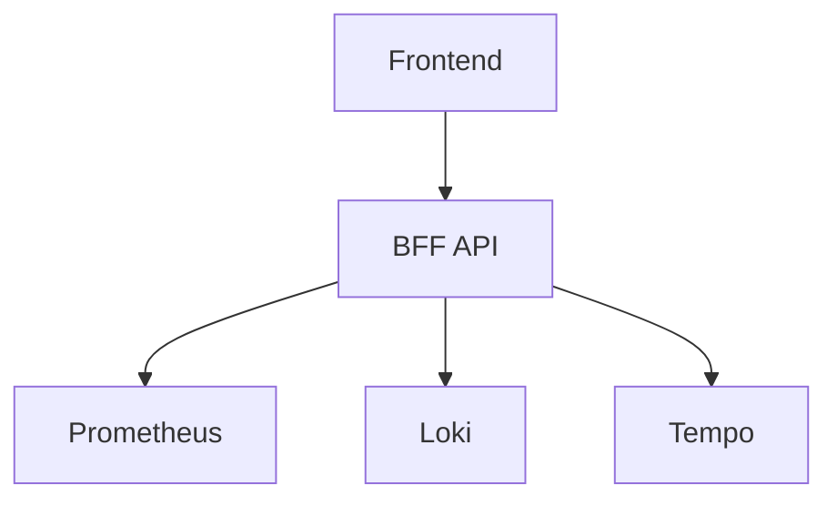

# ObservaStack Documentation

This directory contains the ObservaStack documentation site built with [Docusaurus 3.6+](https://docusaurus.io/).

## 🚀 Quick Start

### Prerequisites

- Node.js 18+ 
- npm or yarn

### Installation

```bash
cd docs
npm install
```

### Development

```bash
# Start development server
npm start

# Open http://localhost:3000
```

### Build

```bash
# Build for production
npm run build

# Serve production build locally
npm run serve
```

## 📁 Structure

```
docs/
├── blog/                    # Blog posts
├── docs/                    # Documentation pages
│   ├── getting-started/     # Installation and setup
│   ├── user-guide/          # User documentation
│   ├── developer-guide/     # Developer documentation
│   ├── deployment/          # Deployment guides
│   └── troubleshooting/     # Troubleshooting guides
├── src/                     # Custom React components
│   ├── components/          # Reusable components
│   ├── css/                 # Custom styles
│   └── pages/               # Custom pages
├── static/                  # Static assets
└── docusaurus.config.ts     # Docusaurus configuration
```

## ✨ Features

- **Modern Stack**: Built with React 18, TypeScript, and Vite
- **Search Integration**: Algolia DocSearch for fast documentation search
- **Responsive Design**: Mobile-friendly documentation
- **Dark Mode**: Built-in dark/light theme switching
- **Blog Support**: Integrated blog for announcements and tutorials
- **Mermaid Diagrams**: Support for architecture diagrams
- **Code Highlighting**: Syntax highlighting for multiple languages
- **Versioning**: Support for multiple documentation versions

## 🎨 Customization

### Branding

Update the branding in `docusaurus.config.ts`:

```typescript
const config: Config = {
  title: 'ObservaStack',
  tagline: 'All Your Signals. One View.',
  favicon: 'img/favicon.ico',
  // ... other config
};
```

### Styling

Custom styles are in `src/css/custom.css`:

```css
:root {
  --observastack-primary: #1a365d;
  --observastack-secondary: #2d3748;
  --observastack-accent: #3182ce;
}
```

### Navigation

Update the navigation in `sidebars.ts`:

```typescript
const sidebars: SidebarsConfig = {
  tutorialSidebar: [
    {
      type: 'category',
      label: 'Getting Started',
      items: ['getting-started/installation', 'getting-started/quick-start'],
    },
    // ... more sections
  ],
};
```

## 🔍 Search Configuration

The documentation uses Algolia DocSearch. To configure:

1. **Apply for DocSearch**: https://docsearch.algolia.com/apply/
2. **Update configuration** in `docusaurus.config.ts`:

```typescript
algolia: {
  appId: 'YOUR_APP_ID',
  apiKey: 'YOUR_SEARCH_API_KEY',
  indexName: 'observastack',
  contextualSearch: true,
},
```

## 📝 Writing Documentation

### Creating New Pages

1. **Add Markdown file** in appropriate directory:
   ```bash
   touch docs/user-guide/new-feature.md
   ```

2. **Add frontmatter**:
   ```markdown
   ---
   title: New Feature
   description: Description of the new feature
   ---
   
   # New Feature
   
   Content goes here...
   ```

3. **Update sidebar** in `sidebars.ts`:
   ```typescript
   items: [
     'user-guide/authentication',
     'user-guide/new-feature', // Add here
   ],
   ```

### Writing Blog Posts

1. **Create blog post**:
   ```bash
   touch blog/2025-08-16-new-release.md
   ```

2. **Add frontmatter**:
   ```markdown
   ---
   slug: new-release
   title: ObservaStack v1.1.0 Released
   authors: [observastack-team]
   tags: [release, features]
   ---
   
   We're excited to announce...
   
   <!--truncate-->
   
   Full content here...
   ```

### Adding Diagrams

Use Mermaid for architecture diagrams:

````markdown

````

### Code Examples

Use syntax highlighting for code blocks:

````markdown
```typescript
// TypeScript example
interface SearchQuery {
  freeText: string;
  type: 'logs' | 'metrics' | 'traces';
  timeRange: TimeRange;
}
```

```python
# Python example
async def search(query: SearchQuery) -> SearchResults:
    return await search_service.search(query)
```
````

## 🚀 Deployment

### GitHub Pages (Automatic)

Documentation is automatically deployed to GitHub Pages when changes are pushed to the `main` branch.

The deployment workflow:
1. **Triggers** on push to `main` branch with changes in `docs/`
2. **Builds** the documentation site
3. **Deploys** to GitHub Pages
4. **Available** at https://observastack.github.io

### Manual Deployment

```bash
# Build for production
npm run build

# Deploy to GitHub Pages
GIT_USER=<Your GitHub username> npm run deploy
```

### Custom Domain

To use a custom domain:

1. **Add CNAME file**:
   ```bash
   echo "docs.observastack.com" > static/CNAME
   ```

2. **Configure DNS** to point to GitHub Pages
3. **Update baseUrl** in `docusaurus.config.ts`

## 🧪 Testing

### Link Checking

```bash
# Check for broken links
npm run build
npx docusaurus-link-checker build
```

### Spell Checking

```bash
# Install cspell
npm install -g cspell

# Check spelling
cspell "docs/**/*.md" "blog/**/*.md"
```

### Accessibility Testing

```bash
# Install axe-core
npm install -g @axe-core/cli

# Test accessibility
npm run build
axe-core build/
```

## 📊 Analytics

### Google Analytics

Add Google Analytics in `docusaurus.config.ts`:

```typescript
presets: [
  [
    'classic',
    {
      gtag: {
        trackingID: 'G-XXXXXXXXXX',
        anonymizeIP: true,
      },
    },
  ],
],
```

### Plausible Analytics

For privacy-focused analytics:

```typescript
scripts: [
  {
    src: 'https://plausible.io/js/script.js',
    'data-domain': 'observastack.github.io',
    defer: true,
  },
],
```

## 🤝 Contributing

### Documentation Guidelines

1. **Clear Structure**: Use consistent heading hierarchy
2. **Code Examples**: Include working code examples
3. **Screenshots**: Add screenshots for UI features
4. **Cross-References**: Link to related documentation
5. **Keep Updated**: Ensure documentation matches current features

### Review Process

1. **Create Branch**: `git checkout -b docs/new-feature`
2. **Make Changes**: Update documentation
3. **Test Locally**: `npm start` and verify changes
4. **Submit PR**: Create pull request for review
5. **Deploy**: Automatic deployment after merge

## 📞 Support

- **Documentation Issues**: [GitHub Issues](https://github.com/observastack/observastack/issues)
- **General Questions**: [GitHub Discussions](https://github.com/observastack/observastack/discussions)
- **Community**: [Discord Server](https://discord.gg/observastack)

## 📄 License

This documentation is licensed under the same license as ObservaStack - see the [LICENSE](../LICENSE) file for details.