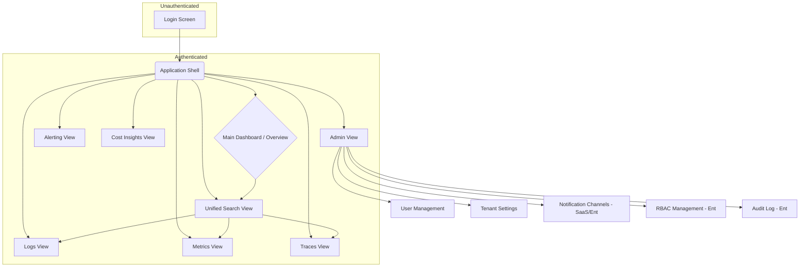
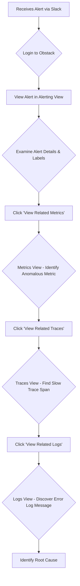

# Obstack UI/UX Specification

This document defines the user experience goals, information architecture, user flows, and visual design specifications for Obstack's user interface. It serves as the foundation for visual design and frontend development, ensuring a cohesive and user-centered experience.

### 1.1 Overall UX Goals & Principles

#### 1.1.1 Target User Personas

*   **DevOps Engineer / SRE:** Technical experts responsible for system reliability, performance, and incident response. They need a data-dense, efficient interface to quickly diagnose and resolve production issues.
*   **Developer:** Focused on debugging application-level problems. They require intuitive workflows to correlate logs, metrics, and traces to pinpoint code-level root causes.
*   **Platform Operator / Manager:** Responsible for infrastructure costs and resource management. They need clear, high-level dashboards to understand spending and identify optimization opportunities.

#### 1.1.2 Usability Goals

*   **Efficiency:** The primary goal. Users must be able to complete the critical "Troubleshooting a Production Incident" journey with minimal clicks and context switching.
*   **Clarity:** Data visualizations must be clear and easy to interpret. The UI should abstract away the complexity of the underlying open-source tools.
*   **Discoverability:** While efficient for experts, the UI should also allow new users to easily discover features and understand how to correlate different observability signals.

#### 1.1.3 Design Principles

1.  **Unified & Cohesive:** The application must feel like a single, seamless product, not a collection of embedded tools.
2.  **Data-First:** The UI's primary purpose is to present data. Design choices should prioritize data density, clarity, and legibility.
3.  **Fast & Responsive:** The interface must be highly performant, especially during data queries, to ensure a smooth and frustration-free troubleshooting experience.
4.  **Accessible by Default:** The application will be designed to meet WCAG 2.1 AA standards, ensuring it is usable by everyone.

### 2. Information Architecture (IA)

#### 2.1 Site Map / Screen Inventory

This diagram shows the primary screens and their relationships. The core of the application is organized around the key observability signals, with a unified entry point for search.

#### 2.2 Navigation Structure

*   **Primary Navigation:** A persistent, vertical navigation bar on the left-hand side of the screen. This will contain direct links to the core views: Dashboard, Search, Logs, Metrics, Traces, Alerts, and Cost Insights. An "Admin" link will be visible to users with appropriate permissions.
*   **Secondary Navigation:** Not applicable for the main views. Within the "Admin" section, a secondary horizontal navigation or sub-menu will be used to switch between User Management, Settings, etc.
*   **Breadcrumb Strategy:** Breadcrumbs will be used within nested views, primarily in the Admin section (e.g., `Admin > User Management > Edit User`). They are not necessary for the flat structure of the main observability views.

### 3. User Flows

#### 3.1 Flow: Troubleshooting a Production Incident

*   **User Goal:** To identify the root cause of a production issue by seamlessly navigating between alerts, metrics, traces, and logs.
*   **Entry Points:**
    *   Receiving an external notification (e.g., Slack, PagerDuty) and clicking a link to a specific alert in Obstack.
    *   Proactively noticing an anomaly on the Main Dashboard.
*   **Success Criteria:** The user successfully identifies a root cause (e.g., a specific error log, a slow database query in a trace) and has enough context to begin remediation.

##### 3.1.1 Flow Diagram

##### 3.1.2 Edge Cases & Error Handling:

*   **No Related Data:** If a user tries to pivot from one signal to another but no correlated data exists (e.g., no traces found for a metric in the selected time range), the UI must display a clear "No data found" message with helpful suggestions, rather than an empty screen.
*   **Invalid Query:** If a user-generated query is invalid, the UI should provide immediate, helpful feedback on how to correct it.
*   **Data Latency:** If there is a known data ingestion lag, the UI could display a subtle indicator to manage user expectations.

**Notes:** This flow represents the "happy path" and is the core value proposition of the platform. The key interaction is the ability to pivot between signals with a single click, carrying over the context (time range, key labels like `pod_name` or `service_name`) at each step.

### 4. Wireframes & Mockups

*   **Primary Design Method:** The user interface will be designed and iterated upon using an AI UI generation tool (e.g., v0.dev, Midjourney). This specification will serve as the primary input for generating the initial design prompts.
*   **Design Assets:** Generated images and code snippets will be stored in the project's `docs/architecture/designs` directory for reference.

#### 4.1 Key Screen Layouts

##### 4.1.1 Screen: Main Dashboard / Overview

*   **Purpose:** To provide a high-level, at-a-glance view of system health, active alerts, and a cost overview. This is the primary landing page after login.
*   **Key Elements:**
    *   **Unified Search Bar:** Prominently placed at the top of the page.
    *   **Global Time Range Selector:** Positioned near the search bar.
    *   **Active Alerts Summary:** A widget showing a count of critical/warning alerts, with a link to the full Alerting View.
    *   **Key Service Health Metrics:** A grid of summary charts for critical services (e.g., API latency, error rates).
    *   **Cost Overview Widget:** A summary of current infrastructure spend with a link to the Cost Insights View.
*   **Interaction Notes:** All widgets are clickable and navigate the user to the corresponding detailed view. The layout should be customizable in the future, but the initial version will be fixed.

##### 4.1.2 Screen: Unified Search View

*   **Purpose:** To provide the primary interface for querying across logs, metrics, and traces simultaneously.
*   **Key Elements:**
    *   **Search Input:** A large, clear text area for entering queries.
    *   **Time Range Selector:** Linked to the global time range but can be overridden locally.
    *   **Results Area:** A unified list displaying heterogeneous results (logs, metric charts, trace summaries).
    *   **Filter Sidebar:** Faceted filters (e.g., by source, service, log level) to refine results.
*   **Interaction Notes:** As the user types, the UI could suggest relevant filters. Each result item is a summary and links to its respective detailed view (e.g., clicking a trace result navigates to the full waterfall view in the Traces screen).

##### 4.1.3 Screen: Logs/Metrics/Traces View

*   **Purpose:** To provide a detailed, signal-specific view for deep analysis.
*   **Key Elements:**
    *   **Query Builder/Input:** A powerful input field tailored to the specific signal (e.g., PromQL for metrics, LogQL for logs).
    *   **Main Visualization:** The primary area for displaying the data (e.g., a chart for metrics, a log list for logs, a waterfall for traces).
    *   **Contextual Detail Panel:** A side panel that shows detailed metadata for a selected item (e.g., a log line, a trace span).
    *   **Cross-Signal Pivot Buttons:** Prominently displayed buttons like "View related logs" or "View related traces" in the detail panel.
*   **Interaction Notes:** The core interaction is selecting an item in the main visualization to populate the detail panel, which then provides the context and actions for pivoting to other signals.

### 5. Component Library / Design System

*   **Design System Approach:** We will build a custom component library using **Tailwind CSS**. To ensure accessibility and handle complex UI logic (like dropdowns, modals, etc.), we will use a headless UI library. This gives us complete control over the visual style via Tailwind while leveraging pre-built functionality.
*   **Recommended Headless UI Library:** **Headless UI** (from the makers of Tailwind CSS).
*   **Recommended Icon Library:** **Heroicons**.

#### 5.1 Core Components

This list identifies the foundational components we will build using Tailwind CSS and Headless UI.

*   **Component: App Bar / Header**
    *   **Purpose:** To provide a consistent top-level container for the unified search bar, global time range selector, and user profile/logout controls.
    *   **Implementation:** A custom-styled `div` using Flexbox or Grid utilities from Tailwind.
*   **Component: Navigation Rail (Vertical Nav)**
    *   **Purpose:** To provide primary navigation between the main application views.
    *   **Implementation:** A list of custom-styled links. Headless UI's `Disclosure` or `Menu` could be used for sub-navigation if needed.
*   **Component: Data Table**
    *   **Purpose:** For displaying lists of alerts, log lines, etc.
    *   **Implementation:** A styled HTML `<table>` element. We will use a library like `TanStack Table` for the logic (sorting, filtering) and style it with Tailwind.
*   **Component: Chart/Graph**
    *   **Purpose:** To visualize time-series data.
    *   **Implementation:** A specialized library (e.g., Apache ECharts, Recharts) will be used and styled to match the Tailwind theme.
*   **Component: Date/Time Range Picker**
    *   **Purpose:** The global control for setting the application's time context.
    *   **Implementation:** We will use a dedicated library for this complex component and style it to match our Tailwind theme.
*   **Component: Button**
    *   **Purpose:** For all user-initiated actions.
    *   **Implementation:** A custom-styled `<button>` element with variants for primary, secondary, and tertiary actions defined with Tailwind classes.
*   **Component: Modal / Dialog**
    *   **Purpose:** To display important information or require user confirmation.
    *   **Implementation:** Built using Headless UI's `Dialog` component, styled with Tailwind.

### 6. Branding & Style Guide

#### 6.1 Visual Identity

*   **Brand Guidelines:** The UI will use a modern, clean "dark mode" aesthetic, common in developer tools. The design should prioritize clarity and data legibility over decorative elements, establishing a professional and trustworthy brand identity.

#### 6.2 Color Palette

*   **Primary:** `#4F46E5` (Indigo) - Used for primary buttons, active navigation items, and key interactive elements.
*   **Secondary:** `#6B7280` (Gray) - Used for secondary buttons and less prominent UI elements.
*   **Accent:** `#10B981` (Emerald) - Used for highlighting success states or positive trends.
*   **Success:** `#22C55E` (Green) - Used for success notifications and confirmations.
*   **Warning:** `#F59E0B` (Amber) - Used for warnings and important notices.
*   **Error:** `#EF4444` (Red) - Used for error messages, destructive action confirmations, and negative trends.
*   **Neutral:** A grayscale palette ranging from `#111827` (dark background) to `#F9FAFB` (white text) will be used for backgrounds, text, and borders.

#### 6.3 Typography

*   **Font Families:**
    *   **Primary:** `Inter` (a clean, modern sans-serif font, excellent for UI text).
    *   **Monospace:** `Fira Code` (a popular choice for displaying code and log data, with programming ligatures).
*   **Type Scale:** We will use Tailwind's default proportional type scale for headings (h1-h6) and body text to ensure a harmonious and consistent hierarchy.

#### 6.4 Iconography

*   **Icon Library:** **Heroicons**, as previously decided. We will primarily use the "outline" style for a clean, modern look.
*   **Usage Guidelines:** Icons should be used to reinforce meaning, not replace text. Every icon-only button must have a text tooltip on hover for clarity and accessibility.

#### 6.5 Spacing & Layout

*   **Grid System:** A standard responsive grid system will be implemented using Tailwind's Flexbox and Grid utilities.
*   **Spacing Scale:** We will use Tailwind's default spacing scale (based on `rem` units) for all margins, padding, and layout gaps to ensure consistent and rhythmic spacing throughout the application.

### 7. Accessibility Requirements

#### 7.1 Compliance Target

*   **Standard:** The application will adhere to the **Web Content Accessibility Guidelines (WCAG) 2.1, Level AA**.

#### 7.2 Key Requirements

*   **Visual:**
    *   **Color Contrast:** All text and meaningful UI elements will have a contrast ratio of at least 4.5:1 against their background.
    *   **Focus Indicators:** All interactive elements (links, buttons, inputs) will have a clear and highly visible focus state.
    *   **Text Sizing:** Users must be able to resize text up to 200% without loss of content or functionality.
*   **Interaction:**
    *   **Keyboard Navigation:** All functionality must be operable through a keyboard alone, in a logical order.
    *   **Screen Reader Support:** The application will be tested with screen readers (e.g., NVDA, VoiceOver). All elements will have appropriate ARIA roles and attributes where necessary.
    *   **Touch Targets:** All interactive elements will have a target size of at least 44x44 pixels for ease of use on touch devices.
*   **Content:**
    *   **Alternative Text:** All meaningful images and icons will have descriptive alternative text.
    *   **Heading Structure:** Pages will use a logical and semantic heading structure (`<h1>`, `<h2>`, etc.) to define the content hierarchy.
    *   **Form Labels:** All form inputs will have clearly associated and descriptive labels.

#### 7.3 Testing Strategy

*   Accessibility will be a continuous effort, not an afterthought.
*   **Automated Testing:** We will integrate an automated accessibility checker (like `axe-core`) into the CI/CD pipeline to catch common issues.
*   **Manual Testing:** Regular manual testing will be performed, including keyboard-only navigation and screen reader checks for all new features.

### 8. Responsiveness Strategy

#### 8.1 Breakpoints

We will use Tailwind CSS's default, mobile-first breakpoint system, which is a robust and widely-accepted standard.

| Breakpoint | Min Width | Target Devices |
| :--- | :--- | :--- |
| `sm` | 640px | Large phones, small tablets |
| `md` | 768px | Tablets |
| `lg` | 1024px | Laptops, small desktops |
| `xl` | 1280px | Standard desktops |
| `2xl` | 1536px | Large desktops |

#### 8.2 Adaptation Patterns

*   **Layout Changes:**
    *   On smaller screens (`sm`, `md`), complex multi-column layouts (like the main dashboard) will stack vertically to ensure readability.
    *   The primary data visualizations will always be given the most available horizontal space.
*   **Navigation Changes:**
    *   On smaller screens (`sm`, `md`), the persistent left-hand vertical navigation rail may collapse into a "hamburger" menu to save space.
*   **Content Priority:**
    *   Core content and primary actions (like the query input and results) will always be prioritized and visible.
    *   Secondary information or controls might be hidden behind "show more" toggles on the smallest screens.
*   **Interaction Changes:**
    *   Hover-based interactions will have a touch-based equivalent (e.g., a tooltip on hover becomes a tappable popover).
    *   Touch target sizes will be enforced as per the accessibility requirements.

### 9. Animation & Micro-interactions

#### 9.1 Motion Principles

*   **Purposeful:** Animations should only be used to provide feedback, guide the user's attention, or smooth transitions. They should not be purely decorative.
*   **Subtle & Fast:** All animations and transitions should be quick (typically under 300ms) and subtle, enhancing the user experience without getting in the way.
*   **Performance-First:** We will prioritize animations that are performant (e.g., using CSS transforms and opacity) to ensure the UI remains fast and responsive.

#### 9.2 Key Animations

*   **State Transitions:** Use subtle transitions (e.g., a soft background color fade) on interactive elements like buttons and navigation links for `hover`, `focus`, and `active` states.
*   **Loading Indicators:** When fetching data, display a subtle loading spinner or a skeleton loader to provide immediate feedback that the application is working.
*   **Modal/Dialog Transitions:** Modals and dialogs will fade in with a slight scale-up effect to draw the user's attention to the center of the screen.
*   **Chart Interactions:** Charts will have smooth animations on initial load and when hovering over data points to reveal tooltips.

### 10. Performance Considerations

#### 10.1 Performance Goals

These goals are based on the Non-Functional Requirements (NFRs) in the PRD.

*   **Page Load:** The initial load time for the main dashboards, measured by Largest Contentful Paint (LCP), should be **under 1.5 seconds** (NFR-P2).
*   **Interaction Response:** The UI should acknowledge any user interaction (e.g., a click or keypress) in **under 100ms**. Data queries should have a p95 latency of **under 300ms** (NFR-P1).
*   **Animation FPS:** All UI animations and scrolling should maintain a consistent **60 frames per second (FPS)** to feel smooth and fluid.

#### 10.2 Design Strategies

To achieve these goals, the following strategies will be employed:

*   **Code Splitting:** The application will be broken down into smaller chunks, so users only download the code they need for the current view.
*   **Lazy Loading:** Components, especially those that are complex or not immediately visible, will be loaded on demand.
*   **Optimistic UI:** For some actions (like acknowledging an alert), the UI may update instantly while the API request is processed in the background, making the application feel faster.
*   **Efficient Data Fetching:** We will avoid fetching unnecessary data and use techniques like pagination and virtualization for long lists (e.g., log views).
*   **Memoization:** React components will be memoized where appropriate to prevent unnecessary re-renders.

### 11. Next Steps

#### 11.1 Immediate Actions

1.  **Review and Approve:** This UI/UX Specification document should be reviewed by all key stakeholders (including the Product Manager and Lead Developer) for feedback and final approval.
2.  **Generate Initial UI Concepts:** Use the `*generate-ui-prompt` command to create a detailed prompt based on this specification. Use this prompt with an AI UI generation tool to create the initial visual design concepts for the core screens.
3.  **Create Frontend Architecture:** The `@architect` agent should now create the detailed `front-end-architecture.md` document, defining the component structure, state management, and data flow based on this specification.
4.  **Groom Initial Stories:** The `@sm` (Scrum Master) can begin grooming the first set of UI-related user stories from the PRD, using this document as a reference for acceptance criteria.

#### 11.2 Design Handoff Checklist

This checklist ensures that all necessary UX and design artifacts are in place before full-scale development begins.

*   [x] All user flows documented
*   [x] Component inventory complete
*   [x] Accessibility requirements defined
*   [x] Responsive strategy clear
*   [x] Brand guidelines incorporated
*   [x] Performance goals established
