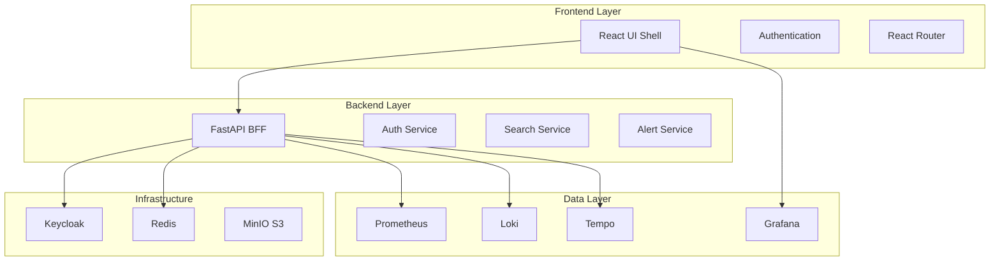
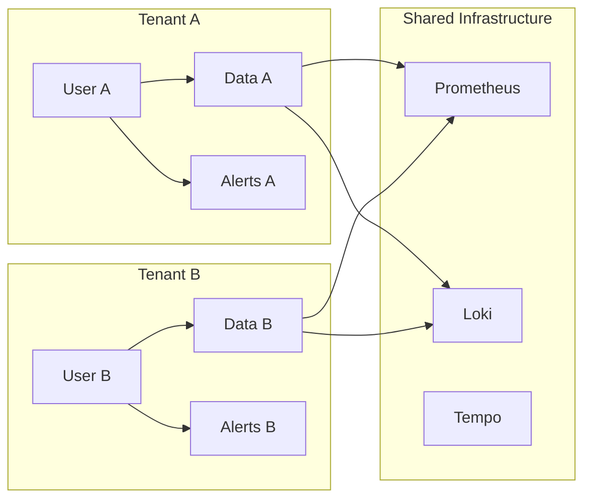
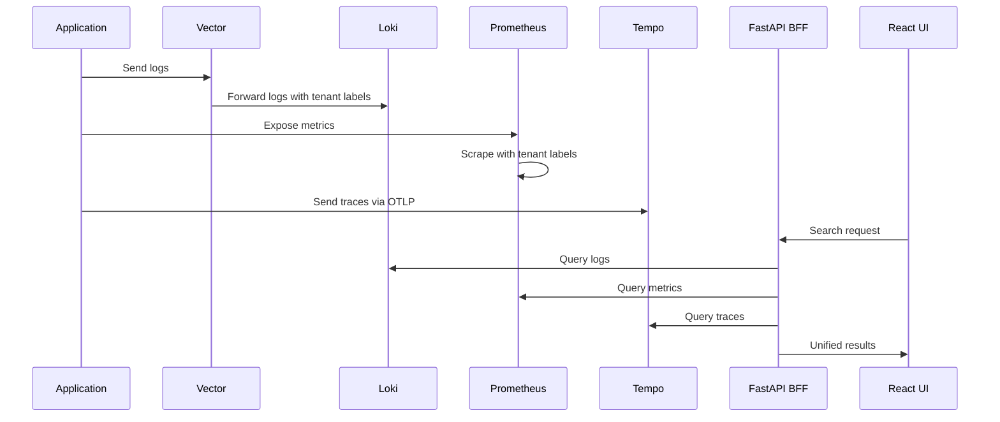
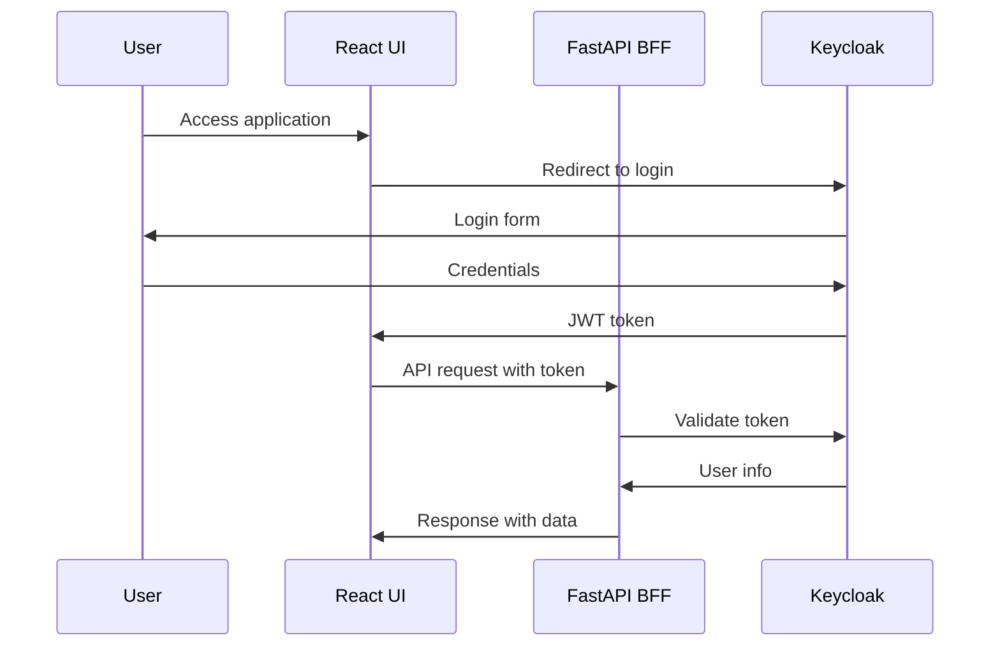

# Architecture

ObservaStack is built using modern web technologies with a focus on scalability, maintainability, and multi-tenant isolation. This document provides a comprehensive overview of the system architecture.

## System Overview



## Architecture Principles

### 1. Backend-for-Frontend (BFF) Pattern

ObservaStack uses the BFF pattern to provide a unified API layer:

- **Single API Gateway**: All frontend requests go through the FastAPI BFF
- **Data Aggregation**: BFF combines data from multiple observability sources
- **Tenant Isolation**: BFF enforces multi-tenant security at the API level
- **Protocol Translation**: Converts between frontend JSON and backend protocols

### 2. Multi-Tenant Architecture



### 3. Microservices-Ready Design

- **Service Boundaries**: Clear separation between search, alerts, and insights
- **API Contracts**: OpenAPI specifications define service interfaces
- **Async Communication**: Event-driven architecture for real-time updates
- **Independent Deployment**: Services can be deployed and scaled independently

## Frontend Architecture

### Technology Stack

- **Framework**: React 19.1.0 with TypeScript 5.9.2
- **Build Tool**: Vite 7.0.0 for fast development and optimized builds
- **Routing**: React Router DOM v7.6.2 with data APIs
- **State Management**: TanStack Query v5.84.1 for server state
- **Styling**: Tailwind CSS 3.4+ for utility-first styling
- **Authentication**: Keycloak integration with JWT tokens

### Component Architecture

```
src/
├── components/           # Reusable UI components
│   ├── ui/              # Basic primitives (Button, Input)
│   ├── forms/           # Form components
│   ├── charts/          # Data visualization
│   └── layout/          # Layout components
├── views/               # Page-level components
├── hooks/               # Custom React hooks
├── services/            # API service functions
├── contexts/            # React contexts
└── utils/               # Pure utility functions
```

### Key Design Patterns

#### 1. Custom Hooks for Data Fetching

```typescript
export function useSearch() {
  const [state, setState] = useState<SearchState>({
    results: [],
    loading: false,
    error: null
  });
  
  const search = useCallback(async (query: SearchQuery) => {
    setState(prev => ({ ...prev, loading: true }));
    try {
      const results = await searchService.search(query);
      setState({ results, loading: false, error: null });
    } catch (error) {
      setState(prev => ({ ...prev, loading: false, error }));
    }
  }, []);
  
  return { ...state, search };
}
```

#### 2. Component Composition

```typescript
// Composable search interface
<SearchContainer>
  <SearchInput onSearch={handleSearch} />
  <SearchFilters filters={filters} onChange={setFilters} />
  <SearchResults results={results} loading={loading} />
</SearchContainer>
```

#### 3. Context-Based State Management

```typescript
// Authentication context
export const AuthContext = createContext<AuthContextType | null>(null);

export function AuthProvider({ children }: { children: ReactNode }) {
  const [user, setUser] = useState<User | null>(null);
  const [loading, setLoading] = useState(true);
  
  // Authentication logic...
  
  return (
    <AuthContext.Provider value={{ user, login, logout, loading }}>
      {children}
    </AuthContext.Provider>
  );
}
```

## Backend Architecture

### Technology Stack

- **Framework**: FastAPI 0.115+ with async/await support
- **Runtime**: Python 3.12+ with uvicorn ASGI server
- **Authentication**: python-jose for JWT handling
- **HTTP Client**: httpx for async HTTP calls to data sources
- **Validation**: Pydantic v2.8+ for request/response models
- **Caching**: Redis for session and query caching

### Service Architecture

```
app/
├── api/                 # API route handlers
│   ├── v1/             # API version 1
│   └── dependencies/    # Shared dependencies
├── auth/               # Authentication & authorization
├── models/             # Pydantic models
├── services/           # Business logic services
├── core/               # Core configuration
└── utils/              # Utility functions
```

### Key Services

#### 1. Search Service

```python
class SearchService:
    def __init__(self, loki_client: LokiClient, prometheus_client: PrometheusClient):
        self.loki = loki_client
        self.prometheus = prometheus_client
    
    async def search(self, query: SearchQuery, tenant_id: str) -> SearchResults:
        """Unified search across all data sources with tenant isolation."""
        
        if query.type == "logs":
            return await self._search_logs(query, tenant_id)
        elif query.type == "metrics":
            return await self._search_metrics(query, tenant_id)
        else:
            return await self._search_unified(query, tenant_id)
```

#### 2. Authentication Service

```python
class AuthService:
    def __init__(self, keycloak_client: KeycloakClient):
        self.keycloak = keycloak_client
    
    async def authenticate(self, token: str) -> User:
        """Validate JWT token and extract user information."""
        payload = jwt.decode(token, verify=True)
        user_info = await self.keycloak.get_user_info(payload['sub'])
        return User.from_keycloak(user_info)
    
    async def authorize(self, user: User, resource: str, action: str) -> bool:
        """Check if user has permission for resource/action."""
        return await self.rbac.check_permission(user, resource, action)
```

#### 3. Alert Service

```python
class AlertService:
    def __init__(self, prometheus_client: PrometheusClient):
        self.prometheus = prometheus_client
    
    async def get_alerts(self, tenant_id: str) -> List[Alert]:
        """Get active alerts for tenant."""
        alerts = await self.prometheus.query_alerts()
        return [alert for alert in alerts if alert.tenant_id == tenant_id]
```

## Data Layer Architecture

### Observability Stack

#### Prometheus (Metrics)
- **Purpose**: Time-series metrics storage and querying
- **Multi-tenancy**: Label-based isolation (`tenant_id` label)
- **High Availability**: Thanos for long-term storage and global querying
- **Federation**: Multiple Prometheus instances for scale

#### Loki (Logs)
- **Purpose**: Log aggregation and querying
- **Multi-tenancy**: Stream labels for tenant isolation
- **Storage**: S3-compatible backend (MinIO) for scalability
- **Ingestion**: Vector for log collection and routing

#### Tempo (Traces)
- **Purpose**: Distributed tracing storage
- **Multi-tenancy**: Trace metadata for tenant isolation
- **Storage**: S3-compatible backend for trace data
- **Ingestion**: OpenTelemetry Collector for trace collection

#### Grafana (Visualization)
- **Purpose**: Dashboard and visualization engine
- **Integration**: Embedded panels in ObservaStack UI
- **Multi-tenancy**: Organization-based isolation
- **Customization**: Tenant-specific branding and dashboards

### Data Flow



## Security Architecture

### Authentication Flow



### Multi-Tenant Security

#### Data Isolation
- **Query Filtering**: All queries automatically filtered by tenant
- **Label Enforcement**: Metrics and logs tagged with tenant labels
- **API Boundaries**: BFF enforces tenant context in all operations

#### Access Control
```python
# RBAC enforcement at API level
@router.get("/search")
async def search(
    query: SearchQuery,
    current_user: User = Depends(get_current_user)
):
    # Automatic tenant filtering
    if not await rbac.can_search(current_user, query.type):
        raise HTTPException(403, "Insufficient permissions")
    
    # Tenant-scoped search
    results = await search_service.search(query, current_user.tenant_id)
    return results
```

## Deployment Architecture

### Development Environment

```yaml
# Docker Compose for local development
services:
  observastack-bff:
    build: ./observastack-app/bff
    ports: ["8000:8000"]
    environment:
      - PROMETHEUS_URL=http://prometheus:9090
      - LOKI_URL=http://loki:3100
  
  observastack-frontend:
    build: ./observastack-app/frontend
    ports: ["3000:3000"]
    environment:
      - VITE_API_BASE_URL=http://localhost:8000
```

### Production Deployment

#### Ansible-Based Deployment
- **Infrastructure as Code**: Ansible playbooks for consistent deployment
- **Multi-Environment**: Support for dev, staging, and production
- **Configuration Management**: Template-based configuration
- **Service Management**: Systemd service definitions

#### Kubernetes Deployment
- **Helm Charts**: Kubernetes deployment via Helm
- **Horizontal Scaling**: Pod autoscaling based on metrics
- **Service Mesh**: Istio for advanced traffic management
- **Monitoring**: Prometheus Operator for cluster monitoring

### Scalability Patterns

#### Horizontal Scaling
```yaml
# Kubernetes HPA configuration
apiVersion: autoscaling/v2
kind: HorizontalPodAutoscaler
metadata:
  name: observastack-bff
spec:
  scaleTargetRef:
    apiVersion: apps/v1
    kind: Deployment
    name: observastack-bff
  minReplicas: 2
  maxReplicas: 10
  metrics:
  - type: Resource
    resource:
      name: cpu
      target:
        type: Utilization
        averageUtilization: 70
```

#### Caching Strategy
- **Redis**: Session and query result caching
- **CDN**: Static asset caching
- **Application-Level**: In-memory caching for frequently accessed data

## Performance Considerations

### Frontend Optimization
- **Code Splitting**: Route-based code splitting with React.lazy
- **Bundle Optimization**: Vite's tree-shaking and minification
- **Caching**: Service worker for offline capability
- **Lazy Loading**: Component and data lazy loading

### Backend Optimization
- **Async Processing**: FastAPI's async/await for I/O operations
- **Connection Pooling**: Database and HTTP client connection pools
- **Query Optimization**: Efficient queries to observability backends
- **Caching**: Redis for expensive query results

### Data Layer Optimization
- **Retention Policies**: Automated data lifecycle management
- **Compression**: Efficient storage formats for logs and metrics
- **Indexing**: Optimized indexes for fast queries
- **Partitioning**: Time-based data partitioning

## Monitoring and Observability

### Application Metrics
```python
# Custom metrics for ObservaStack itself
from prometheus_client import Counter, Histogram, Gauge

search_requests = Counter('observastack_search_requests_total', 
                         'Total search requests', ['tenant_id', 'type'])
search_duration = Histogram('observastack_search_duration_seconds',
                           'Search request duration')
active_users = Gauge('observastack_active_users', 'Active users by tenant',
                    ['tenant_id'])
```

### Health Checks
```python
@router.get("/health")
async def health_check():
    """Comprehensive health check for all dependencies."""
    checks = {
        "prometheus": await prometheus_client.health_check(),
        "loki": await loki_client.health_check(),
        "tempo": await tempo_client.health_check(),
        "keycloak": await keycloak_client.health_check(),
        "redis": await redis_client.ping()
    }
    
    healthy = all(checks.values())
    status_code = 200 if healthy else 503
    
    return JSONResponse(
        status_code=status_code,
        content={"status": "healthy" if healthy else "unhealthy", "checks": checks}
    )
```

## Next Steps

- [API Reference](api-reference.md) - Detailed API documentation
- [Contributing Guide](contributing.md) - How to contribute to ObservaStack
- [Testing Strategy](testing.md) - Testing approaches and frameworks
- [Extending ObservaStack](extending.md) - Adding new features and integrations